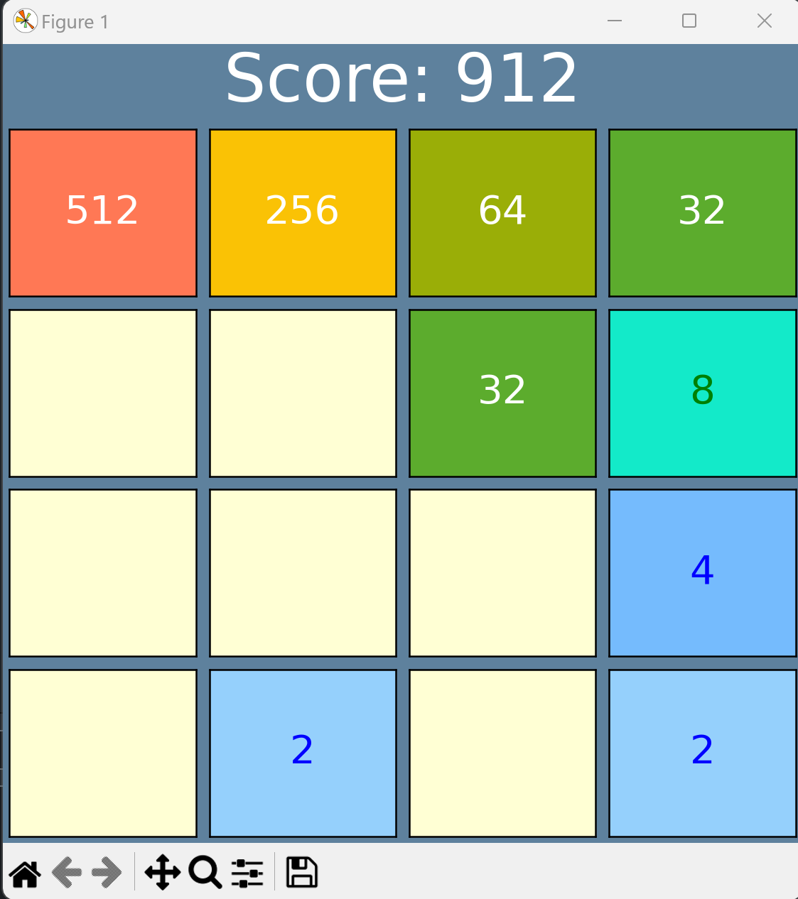
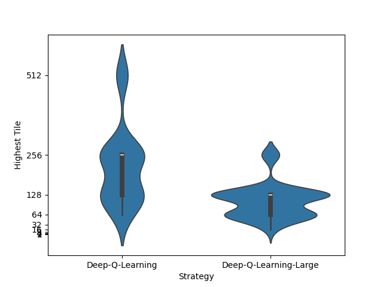

# Game 2048
Python implementation of the game 2048.
## Visual Mode

## Game Strategies
There are 5 game strategies implemented:
- **Random**: Makes a random next move.
- **Left Down**: Try Left or Down, else Right or Up.
- **Simple Max**: Checks all possibilities of the next move and takes the move that maximizes the average.
- **Two Max**: Checks all possibilites of the next two moves and takes the move that maximizes the average value.
- **Deep Q-Learning**: Uses a Neural Network to approximate the most rewarding moves. Needs to be trained. 

## Deep Q-Learning

Replay of a Game played by the Deep Q-Lerning agent with 23k training steps, with batch size 512. 

## How to Run 
This script requires the following Python packages:
- numpy
- matplotlib
- tqdm

For QLearning additionally:
- torch

Then run `python main.py` and follow the instructions and mode selection in the command prompt
