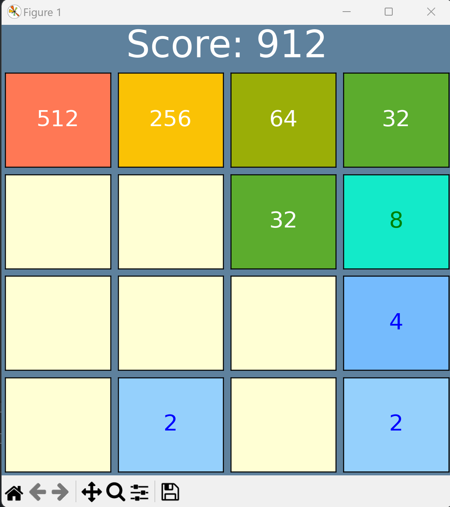
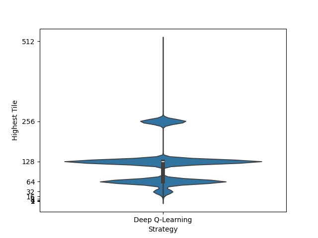

# Game 2024
Python implementation of the game 2024.
## Visual Mode

## Game Strategies
There are 4 simple game strategies implemented:
- **Random**: Makes a random next move.
- **Left Down**: Try Left or Down, else Right or Up.
- **Simple Max**: Checks all possibilities of the next move and takes the move that maximizes the average.
- **Prob Max**: Checks all possibilites of the next two moves and takes the move that maximizes the average value.

## How to Run 
This script requires the following Python packages:
- numpy
- matplotlib
- tqdm

Then run `python main.py` and follow the instructions and mode selection in the command prompt
